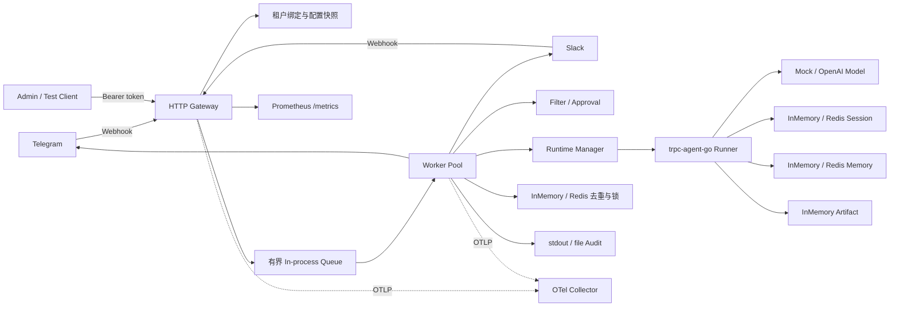
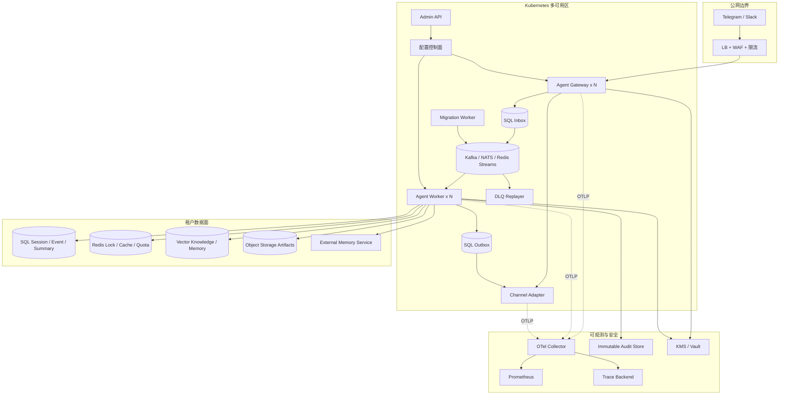
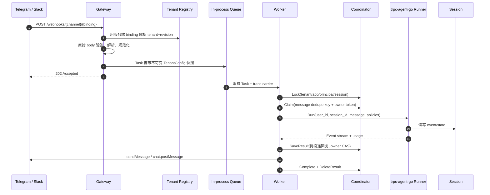
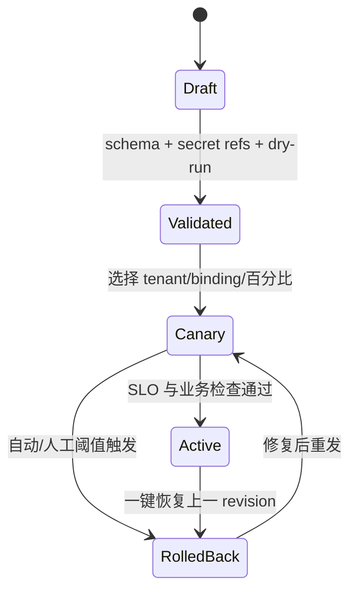

# 多租户 Agent 平台架构设计

本文给出基于 `trpc-agent-go` 的多租户、双 IM Agent 平台设计。为避免把方案描述成已经完成的功能，全文使用以下标记：

- **最小实现**：当前 `solution/` 中可运行、可由测试或接口直接验证的行为。
- **部分实现**：已有接口、配置或单机语义，但尚不满足生产级持久化、多节点或完整治理要求。
- **生产推荐**：赛题要求的目标架构；需要替换或增加基础设施后才能获得所述保证。

## 1. 目标、边界与不变量

平台允许同一组 Gateway/Worker 服务多个租户，每个租户独立选择 Agent、模型、工具、IM 绑定、数据后端、预算和审计策略。最重要的不变量是：

1. 外部请求不能自行声明 `tenant_id`。Webhook 路径中的 `(channel, binding_id)` 必须先命中服务端绑定，再由绑定反推出租户。
2. 每个存储键、队列分区键、锁键和缓存键都包含不可伪造的租户命名空间。
3. 同一逻辑 session 的写入按顺序提交；不同 session 可并行。
4. 工具权限在执行点再次校验，不能只依赖提示词或工具列表隐藏。
5. 秘密只保存引用，正文默认不进入日志、指标或 trace。
6. 配置修订在一次请求内固定，热更新不能改变正在执行的请求。

当前代码已落实 1、2、4、5 的主要单机路径，以及基于协调锁的 3；生产环境仍需持久 Inbox/Outbox、带 fencing token 的顺序控制和外部配置中心来强化 3、6。

## 2. 租户模型

当前 `config.TenantConfig` 已覆盖赛题要求，YAML 使用 `KnownFields(true)` 拒绝未知字段：

| 维度 | 当前字段 | 用途与隔离边界 |
| --- | --- | --- |
| 租户标识 | `tenant_id`, `version`, `enabled` | 稳定主键、配置修订、启停开关 |
| 应用 | `app.name`, `agent_name`, `description`, `instruction` | Agent 实例和框架 app namespace |
| 模型 | `provider`, `name`, `variant`, `base_url`, `api_key_env`, token/价格参数 | 每租户模型、凭据引用与成本计算 |
| 工具 | `allow`, `deny`, `require_confirmation` | 可见性过滤和执行点授权 |
| IM | `type`, `binding_id`, token/签名 secret 的环境变量名、允许用户、长度 | 账号绑定、验签、身份准入 |
| 数据 | `session`, `memory`, `summary`, `artifact`, `knowledge`, `audit_log` | 每类数据单独选后端与 namespace |
| 审计 | `enabled`, `sink`, `path`, `redact_patterns`, `log_content` | 租户级审计去向和脱敏策略 |
| 预算 | RPM、最大输入字符、月成本上限 | 请求、输入和成本治理 |

`tenant_id`、app 名、agent 名和 `binding_id` 仅接受受限的安全字符。相同 `(channel, binding_id)` 不能属于两个租户。生产推荐把配置存为带版本和签名的不可变文档，并维护 `desired_revision`、`active_revision`、审批人和发布时间，而不是以本地 YAML 作为唯一事实源。

## 3. 组件与部署拓扑

### 3.1 当前最小实现

当前二进制将逻辑组件装配在一个进程中，适合本地演示和单节点验收：



`Gateway`、`Channel Adapter`、队列、`Worker`、`Storage Adapter` 装配和 Admin API 都已存在，但只是同进程模块；内置队列、配置历史、审批 nonce、限流、InMemory 模式的 Session/Memory 和 Artifact 在进程重启后丢失。`/readyz` 当前只返回固定 ready，不代表依赖健康。

### 3.2 生产推荐拓扑



组件职责如下：

| 组件 | 责任 | 扩缩容键 |
| --- | --- | --- |
| Agent Gateway | 验签、绑定解析、规范化消息、持久 Inbox 后快速 ACK | callback RPS、验签 CPU、Inbox 延迟 |
| Channel Adapter | 平台协议和通用消息模型互转、限频、拆包、重试 | 每平台发送 QPS/积压 |
| Durable Queue | 按 session 分区、有序重投、背压、DLQ | backlog、consumer lag |
| Agent Worker | 治理、Runner、模型/工具调用、状态提交、生成 Outbox | 活跃 run 数、模型等待时间 |
| Storage Adapter | 统一 Session/Memory/Summary/Artifact/Knowledge/Audit 能力 | 各后端 QPS/容量 |
| Admin API/配置控制面 | 校验、发布、灰度、回滚、审计 | 配置变更率；不在数据面热路径 |
| Telemetry Collector | 采集、尾采样、脱敏、导出 | spans/s、日志字节/s |

## 4. 一条消息如何运行

当前实现的执行顺序如下。Webhook 返回 `202` 只表示任务进入了本进程队列，不代表已经持久化；进程在 ACK 后崩溃可能丢任务，这是明确的最小实现限制。



生产流程将第 3～4 步替换为 `INSERT Inbox ON CONFLICT DO NOTHING` 与事务提交后 ACK；Inbox dispatcher 投递 durable queue，Worker 的状态更新与 Outbox 在一个提交边界内完成，Outbox dispatcher 才调用 IM。这样节点故障不会让已 ACK 消息静默丢失，投递失败也不会重复运行模型。

## 5. 租户与 session 路由

### 5.1 租户路由

Webhook 路径是：

```text
POST /webhooks/{channel}/{binding_id}
```

查找键为 `channel + "/" + binding_id`。只有查到启用的服务端绑定后才调用对应 Adapter 验签并写入 `tenant_id`；客户端 body 中即使含有租户字段也不会被信任。当前管理/测试入口 `POST /v1/chat/{tenant}` 受 Admin Bearer token 保护，不应作为公开多租户 API。

生产推荐在边缘层也限制每个 binding 的来源 IP/证书，并使用不可枚举的 webhook 路径别名；但路径别名不能替代验签。绑定缓存应以配置 revision 为版本，从控制面通过 watch/pubsub 失效，缓存未命中时回源强一致配置库。

### 5.2 身份与 session 路由

当前代码将外部标识散列为不透明内部 ID：

- 单聊 principal：`H(tenant, binding, channel, external_user_id)`。
- 群聊 principal：`H(tenant, binding, channel, "group", conversation_id)`，因此同一群成员共享 Runner user/session 视图，发送者另存为审计身份。
- session：`H(tenant, app, binding, channel, scope, conversation_id, thread_id)`。
- app namespace：`ta_ + H(tenant, app)`，避免框架 app 名发生跨租户碰撞。

`H` 当前为截断 SHA-256，能提供稳定不透明标识，但不是带密钥的伪匿名化。生产推荐改为 `HMAC-SHA-256(tenant-scoped key, canonical identity)`，支持密钥轮换版本，同时保留外部 ID 的加密映射表供合规删除使用。

队列的推荐分区键为 `H(tenant_id, app_name, session_id)`；同一键固定进入一个分区并由单 consumer 顺序消费，不同 session 自然负载均衡。协调锁/序号是队列失序、再均衡和管理 API 并发写时的第二道防线。

### 5.3 是否需要 sticky session

生产推荐**不需要 HTTP sticky session**。Gateway 无状态，Worker 从共享 Session/Memory 后端恢复上下文；任务本身携带 tenant revision、标准消息和 trace context。负载均衡器可把任意请求发往任意 Gateway。

以下情况只能作为例外：

- 使用 InMemory Session/Memory/队列/协调器时，必须单进程运行；所谓 sticky 也无法抵抗进程重启，不能冒充高可用。
- 流式 WebSocket/SSE 的单条连接在生命周期内天然固定到一个 Gateway，但后续消息仍通过共享 session 恢复，不构成业务 sticky。

## 6. 与 `trpc-agent-go` 的集成边界

每个 `(tenant_id, config_revision, canonical_config_digest)` 懒加载一个 Runtime。`RuntimeManager` 用 per-key singleflight 在全局锁外构建后端，缓存本进程见过的 revision 到停机，使延迟任务可复用精确旧版本；生产控制面还需给缓存设置容量、TTL 与安全排空。Runner 调用明确设置：

- `agent.WithAppName(opaque tenant app namespace)`；
- `agent.WithRequestID(request_id)`；
- `agent.WithRuntimeState(tenant_id, config_revision, channel, sender_id)`；
- `agent.WithKnowledgeFilter(tenant_id, app_name)`；
- `agent.WithToolFilter(...)` 与 `agent.WithToolPermissionPolicyFunc(...)`；
- `agent.WithMaxRunDuration(...)` 和低基数 span 属性。

当前 Runtime 真正接通的后端为：Session 的 InMemory/Redis、Memory 的 InMemory/Redis、Artifact 的 InMemory、Audit 的 stdout/file；Knowledge 未启用。Summary 实际保存在 Session Service 中，当前 `data.summary` 配置尚未参与 Runtime 构造；OpenAI Agent 会读取“已存在的 Session Summary”，但 Session Service 未注入 summarizer，所以当前不会自动生成摘要。配置结构列出的 SQL、vector、object、external 是扩展契约，不能据此声称已有可运行 Adapter。具体一致性和迁移见 [data-consistency.md](data-consistency.md)。

## 7. 五层租户隔离

| 层 | 最小实现 | 生产强化 |
| --- | --- | --- |
| 配置 | 不可变内存快照、binding 唯一、请求固定 revision、最多 10 个本进程历史版本 | 配置 DB + 签名 revision、OIDC/RBAC、四眼审批、pubsub 失效 |
| 数据 | app/session/lock/dedupe key 带租户；不同租户 Runtime | SQL 复合主键/RLS；Redis 独立 ACL/前缀；向量服务端强制 tenant filter；对象桶前缀 IAM |
| 工具 | allow/deny 过滤，执行点 permission policy，危险工具一次性确认 | 平台∩租户∩用户∩资源权限；工具独立服务账号、egress allowlist、沙箱和超时 |
| 日志/trace | 审计只写 hash，Reason/Error 脱敏；trace 丢弃 LLM request/response/messages | Collector 二次脱敏、租户访问控制、不可变 WORM 审计、保留期/删除策略 |
| 密钥 | YAML 只保存 `*_env` 引用，运行时读环境变量；常量时间验签 | Vault/KMS/Secret Manager、短期凭据、租户独立密钥、双密钥轮换、禁止 core dump |

配置隔离不等于物理数据隔离。对强监管租户，应允许独立数据库/schema、向量 collection、对象桶和 KMS key；普通租户可共享集群，但必须使用服务端强制的 `tenant_id` 复合键和数据库 RLS，调用者不能覆盖过滤条件。

## 8. 配置热更新、灰度与回滚

当前 Admin API 支持从同一 YAML 重新加载 tenant revision，以及回滚单租户上一版本；顶层 server、coordination、telemetry 变化会被拒绝并要求重启。Registry 保留每租户最多 10 个内存历史版本，并永久记住本进程已见 revision 的内容摘要以阻止版本号复用；Runtime 按 revision 缓存到进程停机。这能演示“在途请求不切配置”，但历史在重启后消失，且多节点不会自动同步。

生产控制面发布状态建议为：



同一 session 必须固定在一个 revision，至少直到当前 run 结束；涉及提示词、工具和模型的灰度以 `H(tenant, session_id) % 100` 稳定分桶。回滚只切“新请求的 desired revision”，不得删除旧 Runtime、数据 schema 或迁移双写路径，直至 drain 窗口结束。详细运维阈值见 [security-operations.md](security-operations.md)。

## 9. 最小部署与生产部署

### 最小可运行

- 单个 `platform` 进程，`coordination.backend=inmemory`；
- mock 模型可零外部依赖演示；OpenAI 模式通过环境变量注入 key；
- InMemory Session/Memory/Artifact，审计 stdout；也可把 Session、Memory 与 coordination 一起切到 Redis 做共享后端演示；
- Telegram/Slack token 和 signing secret 通过环境变量注入；
- 可选 Redis 用于 coordination、Session 和 Memory；
- `/metrics` 由 Prometheus 抓取，可选 OTLP Collector。

纯 InMemory 模式的目标是复现功能和单机并发，不承诺 ACK 后任务不丢、跨节点 Memory 可见或重启后回滚历史仍在；Redis 模式已经能共享 Session/Memory，但内存队列和配置历史的故障窗口仍存在。

### 生产推荐

- Gateway、Worker、Outbox dispatcher 和各 Channel Adapter 独立 Deployment，跨至少两个可用区；
- SQL Inbox/Outbox/Session 为事实源，Redis Memory 或生产 Memory 服务跨节点共享长期记忆；Redis 同时承载限流、短缓存和租约，durable queue 按 session 分区；
- 启用 PDB、反亲和、HPA/KEDA，优雅停机先摘流量再停止消费并等待在途 run；
- Secret Manager CSI/Workload Identity，服务间 mTLS，NetworkPolicy 与最小权限服务账号；
- OTel Collector、Prometheus、trace/log 后端和不可变审计存储；
- 自动备份、PITR、恢复演练、迁移校验和 DLQ 回放。

生产就绪判断不是“能启动多个副本”，而是：依赖均共享（当前多副本部署至少把 coordination、Session、Memory 全部配置成 Redis，不能残留 InMemory）、消息已持久化后才 ACK、状态提交可防陈旧写、投递由可重试 Outbox 驱动、配额与审批为分布式原子状态、配置修订在所有节点可追踪。
