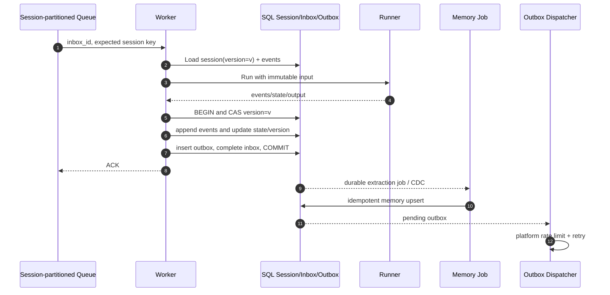
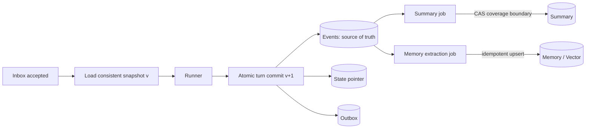
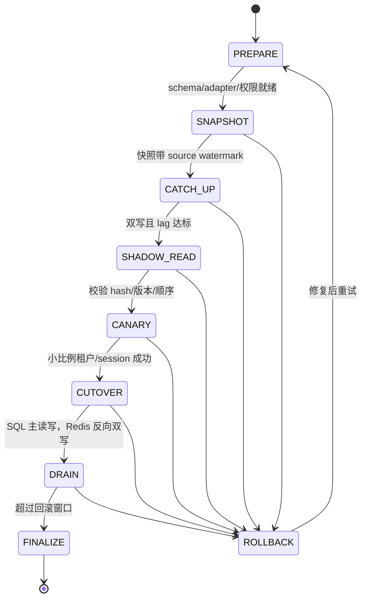

# 数据抽象、一致性与迁移设计

本文描述 Session、Memory、Summary、Artifact、Knowledge 和 Audit Log 的统一访问模型，以及多节点并发、幂等、迁移和最小表结构。文中的保证分为“当前最小实现”和“生产推荐”，两者不能混用。

## 1. 当前能力真值表

配置模型允许声明多种 backend type，但当前 Runtime 并未实现所有适配器。实际能力如下：

| 数据域 | 当前实际后端 | 当前保证 | 生产推荐 |
| --- | --- | --- | --- |
| Session event/state | `trpc-agent-go` InMemory 或 Redis Session Service | InMemory 仅单进程；Redis 可跨节点共享；Worker 对同 session 加协调锁 | SQL 事务事实源或具备 CAS/版本语义的 Session Adapter |
| Summary | 存在于所选 Session Service；`Data.Summary` 当前未参与 Runtime 构造 | OpenAI Agent 会注入已存在 summary，但 Session 未装配 summarizer，不能声称会自动生成/压缩上下文 | 版本化 summary + coverage 边界 + 异步摘要任务 |
| Memory | `trpc-agent-go` InMemory 或 Redis Memory Service | InMemory 仅 Runtime/进程可见；Redis 使用租户 namespace，可跨节点共享，并向 Agent 提供 Memory tools/预加载 | Redis/SQL/外部 Memory/向量库；提交后按明确一致性水位可见 |
| Artifact | InMemory Artifact Service | 进程重启丢失 | 对象存储，元数据在 SQL，租户前缀与 KMS key 隔离 |
| Knowledge | 未装配 | `WithKnowledgeFilter` 已传租户过滤，但没有 Knowledge Service | 远端向量库/搜索服务，服务端强制 tenant filter |
| Audit Log | stdout 或权限 `0600` 的 JSONL 文件 | 追加写；文件仅本机；写失败不会返回到主流程 | 独立 append-only/WORM 存储，异步但有本地缓冲和告警 |
| Inbox/Outbox | Coordinator 中的 dedupe claim 与临时 `SaveResult` | 可避免常见重复运行和投递失败时重跑，但不是事务表 | SQL Inbox + 业务状态 + SQL Outbox 的事务性边界 |

`DataConfig` 中的 `sql`、`vector`、`object`、`external` 目前是扩展意图，不是已经可运行的实现；在增加对应 Adapter 和集成测试前，部署配置不应选择它们。

## 2. 统一访问抽象

生产实现建议把租户配置解析成一个不可变 `BackendBundle`，一次请求只持有同一 revision 的 Bundle：

```text
BackendBundle
├── SessionStore    AppendEvents / Load / CompareAndSetState / CommitTurn
├── SummaryStore    Get / PutIfCoveredVersion / Invalidate
├── MemoryStore     Search / Upsert / Delete / VisibilityWatermark
├── ArtifactStore   Put / Get / Delete / SignedURL
├── KnowledgeStore  Retrieve / Upsert / Delete
├── AuditSink       Append
├── InboxStore      Accept / MarkProcessing / Complete / Fail
└── OutboxStore     Enqueue / Lease / MarkDelivered / Reschedule
```

所有方法都接收由平台构造而非调用者传入的 `Scope`：

```text
Scope = {
  tenant_id, app_name, config_revision,
  principal_id, session_id, request_id, trace_id
}
```

统一抽象并不强迫所有后端提供相同强度。每个 Adapter 在启动时声明 capability，例如 `transactional_turn_commit`、`compare_and_set`、`linearizable_read`、`delete_tombstone`、`cursor_scan`。控制面根据租户要求拒绝不兼容组合：例如要求强顺序的 Session 不能绑定只有最终一致、又没有 CAS 的外部 Memory 服务。

`trpc-agent-go` 的 `session.Service`、`memory.Service`、`artifact.Service` 和 Knowledge 接口作为 Runner 侧 SPI；平台 Adapter 负责租户 scope、版本、迁移双写和指标。不要把裸客户端直接暴露给 Agent 或工具。

## 3. 命名空间与隔离键

每条记录的逻辑主键至少含 `tenant_id`。推荐键如下：

| 数据 | 逻辑键 |
| --- | --- |
| app | `(tenant_id, app_name)` |
| session | `(tenant_id, app_name, session_id)` |
| event/message | `(tenant_id, app_name, session_id, sequence)`，另有唯一 `(tenant_id, channel, binding_id, external_message_id)` |
| summary | `(tenant_id, app_name, session_id, summary_version)` |
| memory | `(tenant_id, app_name, principal_id, memory_id)` |
| channel binding | `(channel, binding_id)` 全局唯一，同时保存 `tenant_id` |
| artifact | `(tenant_id, app_name, artifact_id)` |
| audit | `(tenant_id, occurred_at, audit_id)` |

Redis key 使用版本化前缀，例如 `tap:v1:{tenantHash}:session:{sessionHash}`。若使用 Redis Cluster，hash tag 只包围需要同槽事务的租户/session 摘要，不要把整个租户塞入单槽。SQL 使用复合主键和 RLS 双重保护；向量检索必须由 Adapter 在服务端合并不可删除的 `tenant_id AND app_name` 过滤，不能信任模型生成的 filter；对象存储使用 `tenant/<tenant_id>/app/<app_name>/...` 前缀、IAM condition 和租户 KMS key。

## 4. 同一 session 的并发一致性

### 4.1 当前最小实现

Worker 对 `appNamespace:principalID:sessionID` 加协调锁，然后在锁内执行完整 Runner 和投递前处理。InMemory 协调器只在单进程有效；Redis 协调器通过 `SET NX PX` 获取租约、按 `TTL/3` 续约，并用 compare-delete 释放。队列虽然有多个 worker，但测试验证同一 session 在该锁下形成连续 turn。

该实现仍有三个生产风险：

1. Redis 锁没有 fencing token；持锁者暂停超过租约后恢复，可能以过期所有者身份写入。
2. 续约错误或 compare-renew 返回 0 时，`LockLease.Lost` 会取消当前 Runner；但取消与底层 Session 写之间仍有竞态，没有后端 fencing/CAS 就不能证明陈旧写绝不会落库。
3. In-process queue 不按 session 分区且不持久，顺序完全依赖锁，ACK 后进程崩溃会丢任务。

因此 Redis 协调器是可演示的多节点串行化手段，不是严格的线性一致提交证明。

### 4.2 生产推荐：分区有序 + 版本提交

首选 durable queue 以 `H(tenant, app, session_id)` 分区，使同一 session 通常由同一 consumer 顺序处理；数据库仍以 `session.version` 做最终防线。一个 turn 的提交算法为：

1. 从 Inbox 读取不可变 `message_id`，加载 session 的 `version = v` 和必要上下文。
2. 运行模型/工具；外部有副作用的工具使用独立 idempotency key `request_id + tool_call_id`。
3. 开启数据库事务，锁定 session 行或执行 `UPDATE ... WHERE version = v`。
4. 追加用户事件、模型/工具事件和 assistant 事件，sequence 连续。
5. 更新 state、`version = v + 1`、`last_event_sequence`。
6. 插入 Outbox；把 Inbox 标为 completed；提交事务。
7. CAS 失败说明有并发提交者：丢弃未提交状态，从新版本重放；有副作用工具不能盲目重跑，应先查 tool invocation ledger。



如果使用租约锁，应让协调器返回单调递增 `fencing_token`，并让所有状态写带 `WHERE last_fencing_token < token`；只在 Redis 校验“锁仍存在”不足以阻止陈旧客户端。数据库行锁/CAS 比跨系统分布式锁更容易证明。

## 5. event、state、summary 与 memory 的更新顺序

### 5.1 规范顺序

1. **持久接收**：Inbox 去重并保存原始消息 hash、规范化消息和配置 revision。
2. **读取水位**：读取 `session.version`、事件到 `last_event_sequence`、有效 summary 及其 `covers_through_sequence`。
3. **执行**：Runner 只基于该一致快照运行。
4. **原子 turn 提交**：events → state → session version → Outbox → Inbox completed 在一个事务中；若后端不能跨记录事务，用 event log 为事实源并以 CAS 发布 state pointer。
5. **摘要**：异步任务从确定的 event 范围生成 summary，写入时校验起止序号和 source hash。新摘要只替换覆盖范围更大、模型/提示词版本兼容的旧摘要。
6. **长期记忆**：事务提交后发 durable extraction job；`memory_id = H(tenant, session, source_event_ids, extractor_version)`，幂等 upsert。失败不回滚已完成对话，但要重试并暴露 lag。



不能采用“先更新 summary，再落原始 event”的顺序；摘要失败或模型幻觉时必须可从不可变 event 重建。state 是加速视图而非唯一事实源。

### 5.2 Memory 跨节点可见性

当前 Memory 可选 InMemory 或 Redis：InMemory 只在创建它的 Runtime/进程中可见；Redis Memory 使用 `dsn_env` 与租户 namespace，可由多节点 Runtime 共享，且 OpenAI Agent 会预加载最多 20 条记忆并获得 Memory Service 提供的工具。多副本部署必须把 Memory 和 Session、coordination 一起设为 Redis；只切 Redis Session、仍留 InMemory Memory，不能宣称长期记忆跨节点可见。当前 Redis Adapter 的具体写后可见与冲突语义继承 `trpc-agent-go/memory/redis`，平台尚未暴露显式 watermark，因此严格读后写 SLA 仍按下述生产方案强化。

生产提供两个读取等级：

- `committed`：写 API 返回前，主存储已提交；同租户所有节点读主库或满足 read-your-write token 的副本，适合用户显式“记住”。
- `eventual`：向量索引异步刷新，响应携带 `memory_watermark`；查询可指定 `min_watermark` 等待有限时间，超时则回退 SQL 关键词/最近记忆并标记 degraded。

监控 `memory_index_lag_seconds`、待提取任务数和水位差。检索结果必须带 source event、embedding model/version、created revision，便于审计和迁移。

## 6. IM 重投与端到端幂等

### 6.1 当前最小实现

幂等键为规范化后的 `(tenant, binding, channel, external_message_id)` 哈希。Worker 先取得完整 session 锁，再进入 claim/result 流程，避免排队时间耗尽 processing TTL。Coordinator 维护 `processing/completed` claim 和 TTL；processing claim 带随机 owner token，只有当前 owner 才能保存 pending result、完成或释放，旧 Worker 不能覆盖新 claim：

- 已 completed 的重投标记 `Duplicate=true`；在已取得 session lane 后仍看到 processing，视为孤儿/并行 claim 并返回可重试错误，不能把尚未处理的消息静默当成功。
- Runner 输出先暂存为包含稳定 request ID 和 usage 的 result，并立即记录 Agent 完成用量/allow 审计，再调用 IM；发送失败会释放 claim 但保留 result，下次重投加载 result 并只重发，不重跑 Agent。已有自动测试覆盖此路径。
- 成功后先标 completed，再删除暂存 result。
- processing TTL 取 run timeout/锁窗口的安全倍数而不是 24 小时 completed TTL；崩溃 claim 会较快过期，同时 owner token 防止过期 Worker 删除或完成继任 claim。

局限：状态、claim、用量/审计和投递结果不在同一事务，进程在相邻步骤间崩溃仍可能漏记或重复结算；崩溃留下的 processing claim 到 TTL 前只能失败重试；completed 过期后极晚重投可能再执行；Webhook 在写入本进程队列后即 ACK；IM 发送成功但网络响应丢失时，仍可能再次发送。这是“至少一次传输 + 常见窗口去重”，不是严格 exactly-once。

### 6.2 生产 Inbox/Outbox

Inbound 使用数据库唯一约束：

```text
UNIQUE (tenant_id, channel, binding_id, external_message_id)
```

同一事务内：首次插入返回 accepted，冲突则返回已有状态并立即 ACK。Outbound 用稳定的 `outbox_id` 和平台支持时的 client message id；Dispatcher 租约领取、指数退避、识别可重试/永久错误，最终进入 DLQ。业务语义只能做到“effectively once”：

- 平台支持幂等发送键时传 `outbox_id`；
- 平台不支持时记录 send attempt 与平台 message ID，发送超时采用查询/对账后再决定重试；
- 对撤回、编辑、工具副作用分别维护 operation ledger 和幂等键。

不得把 dedupe TTL 当数据保留期。Inbox 唯一键至少保留平台最大重投窗口加安全余量；若归档，保留 compact tombstone/hash。

## 7. 后端一致性取舍

| 后端 | 典型一致性 | 延迟/吞吐 | 成本与运维 | 适用场景 |
| --- | --- | --- | --- | --- |
| InMemory | 单进程内强一致；跨进程无一致性 | 最低延迟 | 最低成本，重启丢失 | 单元测试、本地演示 |
| Redis | 单主写可提供较强读写顺序；副本读可能滞后；Lua/CAS 可原子化单槽 | 低延迟、高 QPS | 需持久化、哨兵/Cluster、热 key 治理 | 锁、限流、短期 dedupe/cache；小型 Session |
| SQL | 事务、唯一约束、行锁/CAS，易实现强一致 turn | 中等延迟，需索引与分片 | 成熟但要做容量、PITR、连接池 | Inbox/Outbox、Session、事件、配置事实源 |
| 向量库 | 索引刷新多为最终一致 | 检索快，写后可见有延迟 | embedding/索引成本与召回调优 | Knowledge、长期 Memory 检索 |
| 对象存储 | 新对象通常强读后写，列表/跨区域复制可能滞后 | 大对象友好，首字节较慢 | 低单价，需生命周期和 KMS | Artifact、审计归档、迁移快照 |
| 外部 Memory 服务 | 取决于供应商，常为最终一致 | 网络与供应商尾延迟 | 接入快但有锁定、合规和配额风险 | 非关键长期记忆；必须有熔断/导出能力 |

选择原则：对“会影响下一轮回答顺序”的 Session event/state 使用强一致或可验证 CAS；Summary、向量索引和分析型 Audit 可最终一致，但必须暴露水位和 lag；Artifact 元数据强一致、二进制对象可通过 content hash 校验。

## 8. Redis → SQL 迁移

迁移由控制面管理单调状态，所有步骤可重入。推荐状态机：



步骤细节：

1. **PREPARE**：冻结序列化格式版本；SQL 建表/索引/RLS；迁移 ledger 保存 tenant、object、source version、hash、状态。先验证备份和回滚路径。
2. **SNAPSHOT**：按稳定 cursor 扫描 Redis；每条记录携带 `source_version`、event sequence、TTL 绝对到期时间和 content hash，SQL `UPSERT` 幂等导入。不能用 `KEYS *` 阻塞生产实例。
3. **CATCH_UP**：应用先 source-write Redis，再写 mutation journal/SQL；更推荐在启迁前已经把所有写抽象成带 write_id 的双写。比较高水位而不是只看 key 数。
4. **SHADOW_READ**：线上仍返回 Redis，异步读取 SQL 并比较事件序号、state hash、summary coverage；采样不得泄漏正文。
5. **CANARY**：按稳定 session hash 把 1%→5%→25% 读流量切到 SQL，写保持双向或以 journal 可回放；观察错误、P99 和差异率。
6. **CUTOVER/DRAIN**：SQL 主读写；为可回滚，短期反向写 Redis 或持续记录可回放 journal。禁止此时删除 Redis 数据。
7. **FINALIZE**：超过最长 session/rollback 窗口且 reconciliation 为零差异后，只读归档并按审批清理。

回滚只改变读主源，不逆序覆盖较新版本。冲突选择最大单调 version/event sequence，并记录人工审计；绝不能用迁移开始时的旧快照覆盖线上新状态。

## 9. 本地向量库 → 远端向量库迁移

沿用同一状态机，但对象单位是 document/chunk/vector：

1. 固定 canonical `document_id/chunk_id`，保存原文 content hash、chunker version、embedding model/version、维度与删除 tombstone。
2. 若远端 embedding 模型和维度相同，可批量导出/import；不同则从授权的原文对象重新 embedding，不能把不同空间的向量直接混用。
3. Snapshot 后开启带 `mutation_id` 的双写，upsert/delete 均幂等；删除 tombstone 必须先于最终清理传播，避免数据复活。
4. Shadow query 同时检索两端，对比 Top-K overlap、NDCG/人工黄金集命中率、过滤正确率、P95/P99，而不是比较浮点向量是否完全相等。
5. Canary 按租户/session 稳定分桶；远端超时回退本地，并记录 `retrieval_backend` 与 degraded 指标。
6. Cutover 后保留本地只读索引和 mutation journal 至回滚窗口结束；完成租户级导出、数量/hash/tombstone 对账后再清理。

向量迁移的硬门槛包括：`tenant_id` filter 穿透测试 100% 通过、抽样内容 hash 一致、tombstone lag 为零、召回指标不低于约定阈值、尾延迟和费用在预算内。

## 10. 最小关系数据模型

以下是生产目标的逻辑 DDL，字段类型可按 PostgreSQL 方言调整。所有外键和唯一约束都带 `tenant_id`，避免仅凭随机 ID 造成跨租户引用。

```sql
CREATE TABLE tenant (
  tenant_id        text PRIMARY KEY,
  status           text NOT NULL,
  active_revision  text NOT NULL,
  created_at       timestamptz NOT NULL,
  updated_at       timestamptz NOT NULL
);

CREATE TABLE agent_app (
  tenant_id        text NOT NULL,
  app_name         text NOT NULL,
  revision         text NOT NULL,
  agent_name       text NOT NULL,
  config_json      jsonb NOT NULL,       -- 只含 secret 引用
  config_hash      text NOT NULL,
  status           text NOT NULL,
  created_at       timestamptz NOT NULL,
  PRIMARY KEY (tenant_id, app_name, revision)
);

CREATE TABLE channel_binding (
  channel          text NOT NULL,
  binding_id       text NOT NULL,
  tenant_id        text NOT NULL,
  app_name         text NOT NULL,
  config_revision  text NOT NULL,
  secret_ref       text NOT NULL,
  status           text NOT NULL,
  created_at       timestamptz NOT NULL,
  PRIMARY KEY (channel, binding_id)
);

CREATE TABLE session (
  tenant_id        text NOT NULL,
  app_name         text NOT NULL,
  session_id       text NOT NULL,
  principal_id     text NOT NULL,
  scope            text NOT NULL,
  version          bigint NOT NULL DEFAULT 0,
  last_sequence    bigint NOT NULL DEFAULT 0,
  state_json       jsonb NOT NULL DEFAULT '{}',
  fencing_token    bigint NOT NULL DEFAULT 0,
  updated_at       timestamptz NOT NULL,
  PRIMARY KEY (tenant_id, app_name, session_id)
);

CREATE TABLE session_event (
  tenant_id        text NOT NULL,
  app_name         text NOT NULL,
  session_id       text NOT NULL,
  sequence         bigint NOT NULL,
  event_id         text NOT NULL,
  request_id       text NOT NULL,
  role             text NOT NULL,
  event_type       text NOT NULL,
  payload_cipher   bytea,                -- 或受策略约束的结构化 payload
  content_hash     text NOT NULL,
  occurred_at      timestamptz NOT NULL,
  PRIMARY KEY (tenant_id, app_name, session_id, sequence),
  UNIQUE (tenant_id, event_id)
);

CREATE TABLE session_summary (
  tenant_id        text NOT NULL,
  app_name         text NOT NULL,
  session_id       text NOT NULL,
  summary_version  bigint NOT NULL,
  covers_from      bigint NOT NULL,
  covers_through   bigint NOT NULL,
  source_hash      text NOT NULL,
  model_version    text NOT NULL,
  summary_cipher   bytea NOT NULL,
  created_at       timestamptz NOT NULL,
  PRIMARY KEY (tenant_id, app_name, session_id, summary_version)
);

CREATE TABLE memory (
  tenant_id        text NOT NULL,
  app_name         text NOT NULL,
  principal_id     text NOT NULL,
  memory_id        text NOT NULL,
  source_event_ids jsonb NOT NULL,
  content_cipher   bytea NOT NULL,
  content_hash     text NOT NULL,
  embedding_ref    text,
  extractor_version text NOT NULL,
  visibility_watermark bigint NOT NULL,
  deleted_at       timestamptz,
  created_at       timestamptz NOT NULL,
  PRIMARY KEY (tenant_id, app_name, principal_id, memory_id)
);

CREATE TABLE inbox (
  inbox_id         text PRIMARY KEY,
  tenant_id        text NOT NULL,
  channel          text NOT NULL,
  binding_id       text NOT NULL,
  external_message_id text NOT NULL,
  config_revision  text NOT NULL,
  normalized_json  jsonb NOT NULL,
  status           text NOT NULL,
  attempts         integer NOT NULL DEFAULT 0,
  next_attempt_at  timestamptz,
  received_at      timestamptz NOT NULL,
  UNIQUE (tenant_id, channel, binding_id, external_message_id)
);

CREATE TABLE outbox (
  outbox_id        text PRIMARY KEY,
  tenant_id        text NOT NULL,
  inbox_id         text NOT NULL,
  channel          text NOT NULL,
  binding_id       text NOT NULL,
  target_hash      text NOT NULL,
  payload_cipher   bytea NOT NULL,
  status           text NOT NULL,
  attempts         integer NOT NULL DEFAULT 0,
  next_attempt_at  timestamptz NOT NULL,
  platform_message_id text,
  created_at       timestamptz NOT NULL,
  UNIQUE (tenant_id, inbox_id)
);

CREATE TABLE artifact (
  tenant_id        text NOT NULL,
  app_name         text NOT NULL,
  artifact_id      text NOT NULL,
  object_key       text NOT NULL,
  content_hash     text NOT NULL,
  media_type       text NOT NULL,
  size_bytes       bigint NOT NULL,
  created_at       timestamptz NOT NULL,
  PRIMARY KEY (tenant_id, app_name, artifact_id)
);

CREATE TABLE audit_log (
  audit_id         text NOT NULL,
  tenant_id        text NOT NULL,
  occurred_at      timestamptz NOT NULL,
  channel          text NOT NULL,
  user_id          text NOT NULL,
  session_id       text NOT NULL,
  agent_name       text NOT NULL,
  tool_name        text,
  decision         text NOT NULL,
  latency_ms       bigint NOT NULL,
  error_type       text,
  cost_usd         numeric(18,8) NOT NULL DEFAULT 0,
  trace_id         text,
  request_id       text NOT NULL,
  config_revision  text NOT NULL,
  details_hash     text,
  PRIMARY KEY (tenant_id, occurred_at, audit_id)
);
```

大表按时间和 tenant hash 分区；为常见查询建立 `(tenant_id, app_name, session_id, occurred_at)`、Inbox/Outbox 的 `(status, next_attempt_at)` 索引。对外删除采用 tombstone + 后台物理清理，Audit 按法规设置独立保留期。

## 11. 恢复、校验与可观测性

每个 Adapter 至少暴露请求数、错误率、P50/P95/P99、连接池、重试、熔断和当前迁移 backend 标签；不得把 session/user/request ID 放入指标 label。迁移和异步视图额外暴露：

- `session_cas_conflicts_total`
- `inbox_age_seconds`、`outbox_age_seconds`、`dlq_messages`
- `summary_lag_events`、`memory_index_lag_seconds`
- `migration_objects_total{phase,result}`、`migration_lag`、`shadow_mismatch_total`
- `storage_request_duration_seconds{backend,operation,result}`

定期做三类校验：事件序号连续性与 state hash 重放、Inbox-completed 必有最终 Outbox 状态、Memory/Summary source 引用存在。备份只有在隔离环境完成 PITR 并验证租户行数/hash 后才算有效。
