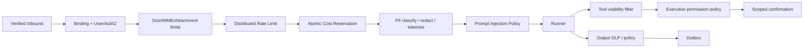
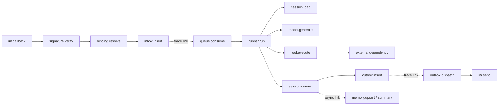
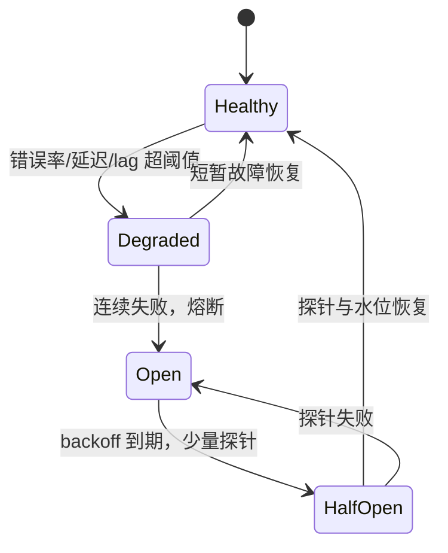

# 治理、安全、可观测与运维设计

本文以“默认拒绝、最小权限、可恢复、可证明”为原则，说明当前最小实现的真实边界和生产强化方案。数据一致性与迁移细节见 [data-consistency.md](data-consistency.md)，IM 协议细节见 [im-adapters.md](im-adapters.md)。

## 1. 信任边界与威胁模型

主要信任边界包括：公网 IM callback → Gateway、Gateway → Queue/Worker、Worker → 模型/工具、Worker → 各数据后端、Admin → 配置控制面、服务 → Telemetry/Audit。重点威胁为：伪造/重放 callback、绑定枚举、跨租户 IDOR、prompt/tool 越权、恶意附件、SSRF、secret 泄漏、重复消息造成重复副作用、陈旧锁写入、配额争抢、日志/trace 暴露 PII，以及配置供应链被篡改。

安全不变量：

1. 先由服务端 binding 确定租户，再验签，再做任何解析后副作用。
2. tenant scope 由平台注入并贯穿队列、Runner、存储、工具、审计；外部参数不能覆盖。
3. 模型提出工具调用不等于授权；执行点必须重新计算有效权限。
4. 原始 secret、私有下载 URL、模型正文默认不进入日志、指标、trace 或错误响应。
5. IM/模型/数据库暂时故障不能驱动系统静默降级到非持久或跨租户共享后端。

## 2. Filter 治理链

### 2.1 当前最小实现

当前治理发生在模型和 Session 调用之前或工具执行点：

| 策略 | 当前行为 | 保证边界 |
| --- | --- | --- |
| IM 用户权限 | binding 的 `allowed_users` 与原始外部用户 ID 精确比较 | 本进程即可判断；未接企业目录/组角色 |
| 输入大小 | 对模型实际收到的正文、群 sender 标注和安全附件元数据按 Unicode rune 计入 `max_input_chars`；附件最多 8 个且 name/MIME/type 分别限长 | 不等于模型 tokenizer；附件字节、下载和病毒扫描仍需独立限制 |
| 请求预算 | 每租户、本进程、固定分钟窗 RPM | 多节点各自计数，重启清零，边界有突发 |
| 月成本预算 | 根据完整规范输入约 4 rune/token、模型 max output、价格和最多 8 次 LLM 调用包络做保守预留 | 未包含动态历史/system/tool 上下文；本进程内存账本，无 actual settle/退款，多节点可超卖 |
| 工具白名单 | `ToolFilter` 隐藏非 allow 工具，deny 优先 | 只控制可见性，不作为唯一授权 |
| 工具执行权限 | `PermissionPolicy` 在每次调用重验 allow/deny | 覆盖框架动态注入工具，默认拒绝未知工具 |
| 危险工具确认 | 一次性 nonce，绑定租户、revision、用户、session、工具和参数 hash，5 分钟过期 | nonce store 在进程内；多节点/重启不共享 |
| 工具决策观测 | permission observer 记录允许/拒绝/询问、tool_name、参数 hash和指标 | 记录授权决策，不等于工具副作用结果审计 |
| 敏感信息 | 审计 Reason/Error 脱敏；内容只记 hash；trace 丢弃 LLM 消息正文 | 尚无入模前 PII tokenization 或出站 DLP Filter |

### 2.2 生产 Filter 顺序



有效工具权限计算为：

```text
effective = platform_allow ∩ tenant_allow ∩ actor_role_allow ∩ resource_policy
effective = effective - (platform_deny ∪ tenant_deny ∪ incident_deny)
```

deny 永远优先。工具服务使用租户专属短期凭据，声明副作用等级、超时、最大输出、可重试性和 idempotency 支持；网络通过 egress allowlist，代码/浏览器类工具在独立沙箱运行。资源级授权例如“只能读取本人订单”必须由工具后端根据不可伪造的 actor/tenant claims 实施，不能依赖 LLM 参数。

PII Filter 按租户选择 `block`、`mask`、`tokenize` 或经审批的 `allow`。可逆 token 保存在租户 KMS 加密 vault；送模型前最小化字段，模型输出和工具结果在进入 Outbox 前再做 DLP。审计记录规则 ID、动作和内容 hash，不记录被脱敏正文。

### 2.3 分布式预算

生产预算采用 Redis Lua 或 SQL 条件更新做原子 reserve：

1. 以模型上限估算 `reserved_cost`，执行 `spent + reserved + estimate <= limit`。
2. 模型结束按 provider usage 原子 settle，多退少补；超额补差触发后续熔断而不篡改已完成结果。
3. 超时/取消按供应商实际 usage 结算；未知账单进入 reconciliation。
4. 设置每分钟请求、并发 run、token/min、工具调用、出站发送和月成本多维限制。

配额 key 包含 tenant 和 UTC billing period，保留账本/审计，不以进程内缓存为事实源。对高价值管理请求可配置保留额度，避免普通流量耗尽全部预算。

## 3. 密钥管理与脱敏

### 3.1 当前最小实现

- YAML 只保存 `ADMIN_TOKEN`、模型 key、IM token/signing secret、Redis/DB DSN 的**环境变量名**；缺失值在运行时返回错误。
- Telegram secret header 使用常量时间比较；Slack 使用带 5 分钟时间窗的 HMAC；Admin Bearer token 也常量时间比较。
- HTTP helper 不向上返回带 Telegram bot token 的 URL，也把底层网络错误归一成安全文本。
- 审计默认只写 `content_hash`/`tool_args_hash`，Reason 与 ErrorType 经过邮箱、手机号、常见 secret 模式和已配置 secret 值替换。
- `trpc-agent-go` 的 Chat/InvokeAgent/ExecuteTool/Workflow spans 在源端 Drop LLM request/response、输入输出消息、system instruction、tool definitions/arguments/results 与 workflow payload；其中 system instruction 的框架直写路径已改为 policy-aware 并有回归测试。Collector 按框架实际属性名再次删除，并通过 transform 清空 status message 与 exception message/stack。

限制：环境变量对同一进程可见，缺少租户级动态轮换；Telegram token 仍出现在出站 URL，反向代理/access log 必须特别处理；自定义错误文本或第三方 SDK 日志仍需审计；Admin API 只有单一共享 Bearer token，没有角色和变更审批。

### 3.2 生产方案

- 使用 Vault/云 Secret Manager + Workload Identity，配置只存不可逆 secret reference 和 version；禁止把 secret 值写回配置 API。
- 每租户/每 binding 独立 token、数据库角色、对象存储前缀和 KMS key；服务账号只读所需 secret。
- 轮换采用 `next` 预热、短期双验签、切 active、撤销 previous 四阶段；模型/API 凭据支持无重启刷新。
- 服务间 mTLS、NetworkPolicy、egress allowlist；Admin 使用 OIDC + RBAC（viewer/operator/security-admin）+ MFA，高风险变更四眼审批。
- Collector、日志 SDK 和错误上报出口做二次 redaction；禁止 query string、Authorization、Cookie、完整 webhook body 和私有文件 URL。
- 对 core dump、profiling、debug endpoint 和 support bundle 做访问控制；备份与审计导出同样加密和按租户授权。

## 4. 指标设计

### 4.1 当前暴露指标

当前 `/metrics` 提供依赖较少的 Prometheus 文本 exporter：

| 指标 | 含义 |
| --- | --- |
| `im_callbacks_total` | callback accepted/invalid_signature |
| `agent_requests_total` | Worker success/error |
| `agent_request_latency_seconds_sum/count` | 端到端 Worker 耗时 |
| `im_delivery_total` | IM 投递 success/error |
| `model_tokens_total` | prompt + completion token |
| `tenant_cost_usd_total` | 按配置价格估算的实际 usage 成本 |
| `tool_permission_total` | 工具 allow/deny/ask 决策 |

Exporter 只接受 `tenant/component/result/channel/backend` 标签，主动丢弃 request/user/session/trace ID，避免高基数。`Observe` 当前只有 sum/count，不是可计算 P95/P99 的 histogram。配置 OTLP 后还会初始化 `trpc-agent-go` MeterProvider，把模型 operation duration、TTFT、token usage、Agent 与工具 duration histogram 发往 Collector 的 OTLP metrics pipeline，并由 `:9464` Prometheus exporter 暴露；平台 `/metrics` 与这组框架指标是两个互补出口。

### 4.2 生产指标清单

| 范畴 | 指标建议 |
| --- | --- |
| 请求/IM | callback RPS、验签失败、Inbox duplicate、ACK latency、queue lag、投递 success rate、429、重试/DLQ、outbox age |
| Runner/模型 | run count、first-token/total latency histogram、timeout/fallback、prompt/completion/cache token、provider quota |
| 工具 | calls、permission decisions、duration histogram、timeout/error、sandbox kill、side-effect reconciliation |
| Session/Memory | backend operation latency/error、CAS conflict、lock wait/lost、summary lag、memory visibility/index lag、cache hit |
| 租户成本 | request/token/tool/storage/egress cost、reserved/spent/budget ratio |
| 资源 | CPU、RSS、goroutine、GC、FD、HTTP connections、worker busy、queue utilization |

低基数 label 仅使用 tenant（租户数过大时改用分层/哈希或 exemplar）、channel、provider、model family、tool catalog name、backend、operation、result、revision cohort。具体 request/trace 通过 exemplar 或日志关联，绝不做 label。成本指标以账本为事实源，Exporter 累加值只用于近实时观察。

建议 SLO：

- 已验签 callback 持久 ACK 可用性 ≥ 99.95%，P99 小于平台 deadline 的 30%。
- 非模型依赖的系统错误率 < 0.5%；Outbox 5 分钟内最终投递率 ≥ 99.9%。
- 无未解释的跨租户访问，目标为 0；审计丢失目标为 0。
- P95 完整响应延迟按模型/业务分层定义，不用全租户单一阈值掩盖慢租户。

## 5. OpenTelemetry 链路

当前启动时设置 W3C TraceContext + Baggage；配置 OTLP endpoint 后启动 `trpc-agent-go` trace exporter。Gateway 从 HTTP header 提取 context，入队前注入 carrier，队列 Worker 恢复；显式 span 包含 `im.callback`、`signature.verify`、`worker.process`、`im.send`，Runner/模型/工具可使用框架自身 instrumentation。当前代码没有为 binding lookup、queue publish/consume、每个 Session/Memory Adapter 操作逐一创建平台 span，因此不能声称所有目标节点都已完整观测。

生产目标链路：



跨 durable queue/Outbox 的异步 span 使用原 trace 的 **link**，同时创建新的消费 trace，避免把数小时重试做成一个超长 parent-child trace。传播字段写消息 header，不把 Baggage 中的用户正文传播。允许的 span 属性包括 tenant（可按策略 hash）、channel、revision cohort、backend、operation、result、retry count；禁止 raw user/session、prompt、tool args、token、DSN、文件 URL。对 error trace 尾采样，对成功流量低比例采样，审计日志始终独立保留。

## 6. 审计日志

当前 `audit.Entry` 字段已覆盖赛题要求：

```text
timestamp, tenant_id, channel, binding_id, user_id, session_id,
agent_name, tool_name, decision, reason, latency_ms, error_type,
cost_usd, trace_id, request_id, config_revision,
content_hash, tool_args_hash
```

用户/Session 是租户作用域的伪匿名 ID；正文和工具参数只存 SHA-256 hash。入站 deny、完整 Agent allow 和工具 permission decision 都有写入路径。stdout/file Router 使用请求固定 revision 的策略与动态解析的该 revision secret 引用，reload 不会把在途旧请求路由到新 sink；file 权限为 `0600`。写失败增加 `audit_write_failures_total` 但不阻塞回复，因此审计存储故障仍可能丢记录，且 tool decision 的 latency/cost/error 还不完整。

生产审计必须包含：事件/工具 call ID、actor 类型、资源 scope、policy/rule version、输入输出 hash、approval ID/approver、工具副作用结果、重试次数和前一记录 hash。写入本地加密缓冲或 durable audit queue；高风险工具可配置审计不可用时 fail closed。中心存储 append-only/WORM、按租户 RBAC、保留期与 legal hold，使用链式 hash/批次签名检测篡改。定期对“业务完成数、工具调用数、审计记录数”做对账。

## 7. 故障恢复与降级

### 7.1 原则

降级必须维持隔离与数据正确性。不能因为 Redis/SQL 不可用就自动退到本机 Memory/Session，也不能跨租户复用模型 key、工具凭据或缓存。优先级为：持久接收 → 保持幂等 → 延迟处理 → 明确安全失败；体验优化排在数据安全之后。

| 故障 | 当前最小实现 | 生产检测与处理 | 恢复/对账 |
| --- | --- | --- | --- |
| Gateway 节点退出 | 未入队返回失败；已 202 的本进程任务可能丢 | LB 摘流；先持久 Inbox 再 ACK；多 AZ 副本 | 扫描 accepted/未 dispatch Inbox |
| Worker 节点退出 | In-process 任务丢；Redis claim 到期后可重试 | durable queue lease 到期重投；状态 CAS/fencing 防陈旧写 | 查 processing 超时、tool ledger 和 Outbox |
| IM 重投 | claim 去重；pending result 复用 | Inbox 唯一约束；已完成返回 ACK；Outbox 独立重试 | message/outbox ID 对账，未知发送结果人工判定 |
| IM 429/5xx | worker 最多 3 次短重试，未解析 Retry-After | binding 令牌桶；Retry-After/指数退避+jitter；熔断和 DLQ | 平台恢复后限速 replay，防流量洪峰 |
| Session DB 短暂不可用 | Process 返回错误，队列短重试后仅记录日志 | 不运行模型；queue NACK/backoff；连接池隔离、熔断；可发持久化的延迟提示 | DB 恢复后按 session 顺序 drain，验证 event sequence |
| Redis 协调不可用/锁丢失 | 请求失败；续约失败会通知并取消 run，但 Session 后端无 fencing/CAS，取消仍可能与状态写竞态 | queue partition + SQL CAS；租约返回 fencing token；失锁取消 run | 检测 CAS conflict/陈旧 token，重放事实事件 |
| Memory/向量不可用 | InMemory 不依赖远端；Redis Memory 操作会受 Redis 故障影响 | 对话可标记 degraded 并跳过非关键召回；显式“记住”按策略 fail | durable extraction 重放、检查 watermark/index lag |
| 模型超时/429 | run timeout 默认 90 秒；整体任务可能短重试 | cancellation；只对未产生副作用且错误可重试的调用重试；同等级备用模型/安全模板 | 记录 provider request ID/usage；避免双计费，探针半开 |
| 工具失败 | Runner 返回错误；permission 已记录 | 工具独立超时/熔断；只重试声明幂等工具；危险副作用查 ledger，不自动重做 | reconciliation 查询真实外部状态，人工补偿 |
| Audit 后端失败 | 写错误被忽略 | 本地加密 WAL；高风险 fail closed；普通请求告警并缓冲 | WAL replay 与数量/hash 对账 |
| 配置服务失败 | 使用本进程最近快照 | 使用已验证 last-known-good，有 TTL 和 revision；禁止无配置启动新租户 | 服务恢复后签名校验、差异审计，不盲目覆盖 |

故障状态可统一为：



## 8. 灰度发布与租户级回滚

### 8.1 当前最小实现

`POST /admin/v1/reload` 重新读取 YAML并发布不可变 tenant 快照；顶层 server/coordination/telemetry 变化拒绝热更并要求重启。`POST /admin/v1/tenants/{tenant}/rollback` 回滚该租户。Registry 保留最多 10 个本进程历史版本并拒绝任何已见 version 的内容变更。Runtime 按 `(tenant, revision, digest)` singleflight 构建并缓存到停机，使延迟与在途请求继续使用原 revision。

这不是分布式配置控制面：节点各自 reload、历史重启丢失、Admin 是单 Bearer token，也没有自动指标门禁。

### 8.2 生产发布流程

1. 生成不可变、签名 revision；schema、secret ref、模型连通性、工具权限和迁移兼容性 dry-run。
2. 影子评估固定脱敏数据集，不产生工具副作用和真实 IM 投递。
3. 先内部 tenant，再按 `H(tenant, session_id)` 稳定分桶 1%→5%→25%→50%→100%；同一 session 不跨版本漂移。
4. 每阶段至少覆盖一个业务高峰/约定窗口，检查系统错误、P95/P99、工具 deny/ask 异常、token/成本、内容安全、投递率和人工质量集。
5. 超阈值自动冻结扩量并把 `desired_revision` 原子切回上一版；旧 Runtime、schema、secret previous 和双写路径保留至 drain 完成。
6. 回滚后扫描新 revision 的 Inbox/Outbox/tool ledger，补偿其外部副作用；配置回滚不能自动撤销已发生业务操作。

示例门禁（应按 SLO 配置而非硬编码）：新版本系统错误率较基线增加 >1 个百分点、P95 增加 >30%、每请求成本增加 >25%、IM 投递率低于 99%、任一跨租户/审计完整性告警，立即回滚。模型输出质量采用离线评测和人工抽检，不能只看基础设施指标。

## 9. 容量评估

定义：

- `λ_cb`：峰值 callback/s；`b`：每 callback 平均规范消息数；`p`：验签/过滤后接受比例。
- `λ = λ_cb × b × p`：进入 Worker 的消息/s。
- `T_run`：一次 Runner 的目标 P95 秒数；`C_node`：单节点允许的并发 run；`U`：目标利用率（通常留 20%～40% 余量）。
- `Tin/Tout`：每请求平均输入/输出 token；`Lout`：输出字符；`Lplatform`：平台每段安全长度。

核心公式：

```text
并发中的 run 数          R = λ × T_run                 (Little's Law)
Worker 节点数            N = ceil(R / (C_node × U))
单节点稳态吞吐           μ_node = C_node / T_run
突发队列容量             B >= max(0, λ_peak - N×μ_node) × D_burst × safety
积压清空时间             T_drain = backlog / (N×μ_node - λ_normal)
模型 token/s             Q_token = λ × (Tin + Tout)
每月模型成本             Cost = M × (Tin×Pin + Tout×Pout) / 1,000,000
IM send op/s              Q_im = λ × (ceil(Lout/Lplatform) + edits + uploads)
Redis command/s           Q_redis = λ × (dedupe_ops + lock_ops + renewals + cache_ops)
SQL transaction/s         Q_sql_tx = λ × (inbox_tx + turn_tx + outbox_delivery_tx)
```

`renewals ≈ ceil(T_run / (lock_ttl/3))`。SQL 还需用每事务语句数估算 statement QPS、WAL、索引和连接池；连接数不是越多越好，Worker 通过并发 semaphore 与 DB pool 容量联动。存储容量按原始/规范消息、事件、summary、memory、artifact、审计的日增量 × 保留天数 × 副本/索引/压缩系数计算。

一个仅用于演示计算方法的样例：峰值 `λ=20 msg/s`、`T_run=4s`、`C_node=32`、`U=0.7`，则 `R=80`，至少 `ceil(80/22.4)=4` 个 Worker 节点。若 60 秒突发为 40 msg/s，4 节点理论服务率 32 msg/s，取 safety=2，队列至少 `(40-32)×60×2=960` 条。平均 800 input + 200 output token 时模型配额需至少 20,000 token/s；若平均 1.1 个文本分片，则 IM 出站约 22 op/s，尚未计流式编辑和文件上传。

容量压测必须覆盖：单 hot session（验证排队而非并发写）、多租户公平性、大输出拆包、模型尾延迟、数据库故障恢复、IM 429 和 2 倍预期峰值。HPA 以 busy runs、queue lag、callback RPS 联合扩容，不能只看 CPU，因为模型等待型 Worker CPU 可能很低。

## 10. 部署与运行手册

### 10.1 最小可运行

- 单 `platform` 进程 + mock 模型；InMemory coordination/session/memory/artifact；审计 stdout。
- 可选 Redis coordination/Session/Memory 和 OTel Collector；若启动多个副本，三者必须全部切为 Redis，secret 通过环境变量注入。
- `/healthz`、`/readyz`、`/metrics` 和 Admin reload/rollback 可用。

当前 `/readyz` 固定返回 ready，队列、Redis、模型和审计依赖不可用时也可能通过；仅可用于演示。单机模式不能通过加 LB 或 sticky session 获得持久高可用。

### 10.2 生产推荐

- Kubernetes 至少两个可用区：Gateway、Worker、Outbox dispatcher、Channel Adapter 各自 Deployment；PDB、反亲和、requests/limits、HPA/KEDA。
- SQL 多 AZ + PITR，durable queue 三副本，Redis HA，向量/对象存储跨区策略按 RPO/RTO 选择。
- `startupProbe` 检查配置/secret 装载；`readinessProbe` 检查能否接收并持久化 Inbox；`livenessProbe` 只判断死锁/事件循环，不因外部 DB 抖动反复杀进程。
- 优雅停机：先 readiness=false、停止新任务、延长/转移 lease、等待在途 run 或到 hard deadline、持久化状态，再退出。
- IaC、镜像签名/SBOM、非 root/read-only rootfs、seccomp、NetworkPolicy、定期漏洞和恢复演练。

### 10.3 告警与首响动作

| 告警 | 首响 |
| --- | --- |
| Inbox/queue lag 持续增长 | 冻结非必要灰度；确认模型/DB/Worker瓶颈；扩 Worker；保护 callback ACK |
| Outbox 429/失败率上升 | 按 binding 熔断/降速；检查 Retry-After/token；禁止全量快速 replay |
| Session CAS conflict/失锁 | 检查分区键和 consumer rebalance；暂停受影响 session；重放并校验事件序号 |
| 成本预算异常 | 冻结高成本模型/工具；检查 token 激增、回环、重试；以账本而非指标估算对账 |
| 审计写失败 | 启用本地 WAL；高风险工具 fail closed；扩容/恢复审计存储后有序 replay |
| 跨租户过滤测试/告警 | 立即隔离相关 backend/版本和撤销凭据；保全证据；按事件响应流程通知与修复 |

每季度至少做节点 kill、DB 30 秒不可用、模型超时、IM 429、secret 轮换、配置回滚和备份恢复演练，并记录实际 RTO/RPO。恢复完成的标准是业务状态、Outbox、工具副作用和审计全部对账，而不只是 Pod 恢复 Running。
